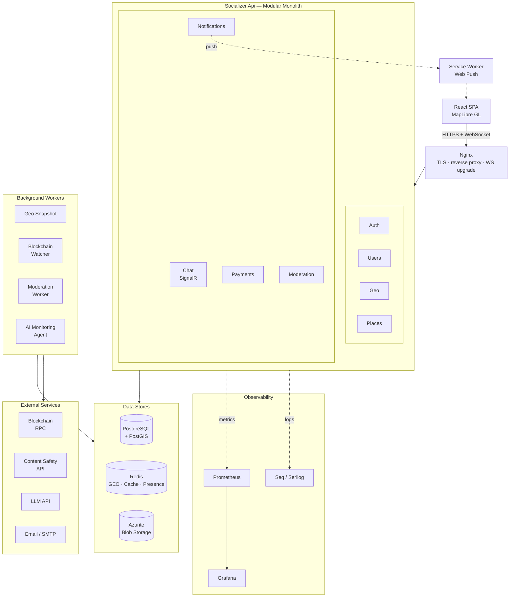
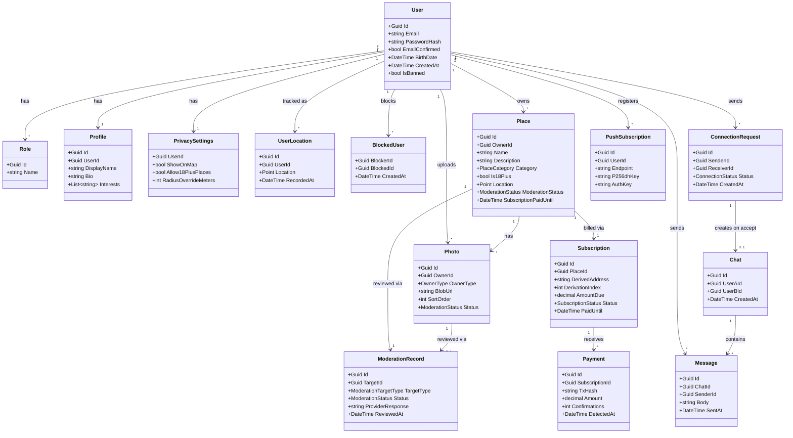
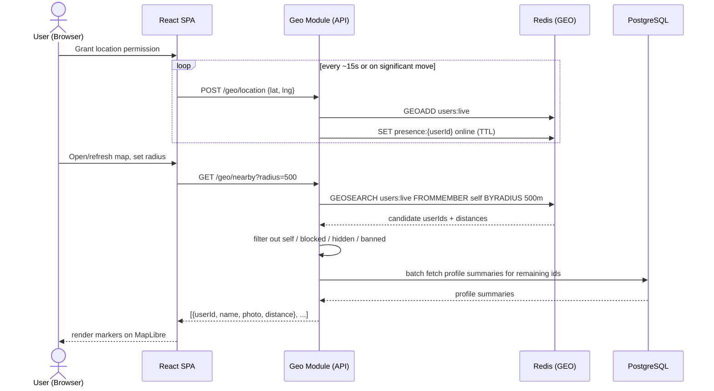
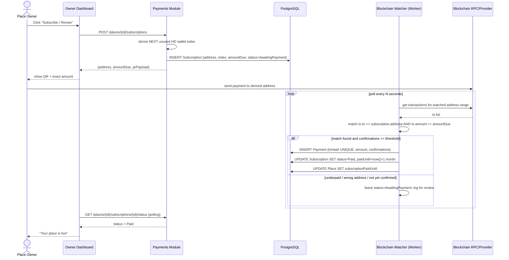
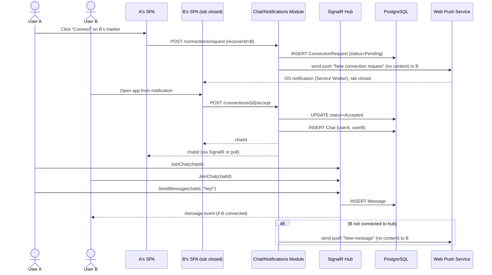
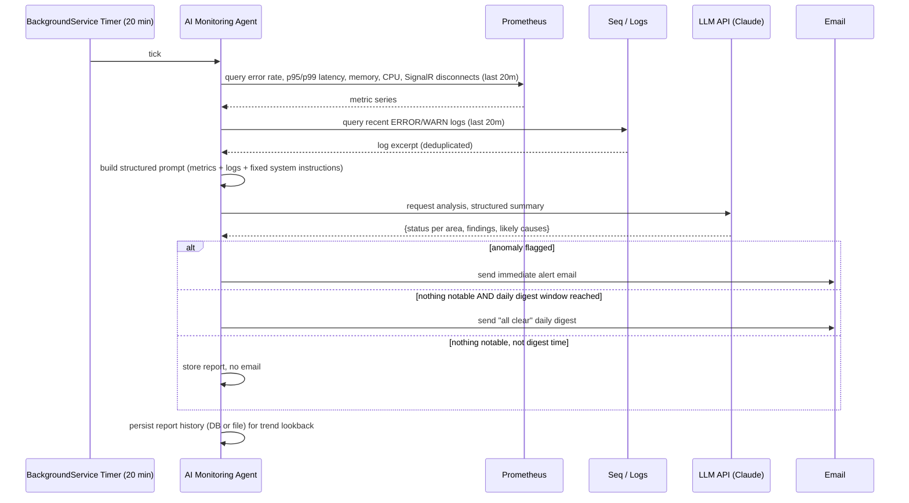

# Socializer — UML & Architecture Diagrams

All diagrams are Mermaid — they render natively in GitHub (README, PRs, Issues, wikis) and in most IDE Markdown previews. No external tool required; edit the code blocks directly as the design evolves.

Companion document: `Socializer_Roadmap.md` (sprint plan + backlog). This file is the "what it looks like" reference; the roadmap is the "in what order do we build it" reference.

---

## 1. Component / Architecture Diagram

High-level view of how the pieces talk to each other: modular monolith backend, its data stores, and the background workers that don't sit on the request path.



**Reading notes**

- This is the *shape* of the system, not every wire — one aggregated arrow stands in for "every module in this box talks to every store in that box over synchronous calls." Solid = request path, dashed = async/background/observability.
- The exact who-talks-to-whom detail (which the arrows would otherwise tangle trying to show) is spelled out below instead of on the canvas:

  | From | To | Why |
  |---|---|---|
  | Geo Module | Redis | live `GEOADD`/`GEOSEARCH` — this is the hot path, not Postgres |
  | Chat Module | Redis | SignalR backplane — only load-bearing once you run >1 API instance (Sprint 7 ships without it, Sprint 14/15 may add it) |
  | Users/Places Modules | Azurite | photo blobs |
  | Geo Snapshot Worker | Redis → Postgres | periodic flush of live positions into durable history |
  | Blockchain Watcher | Blockchain RPC → Postgres | polls chain, matches tx to a `Subscription`, marks it paid |
  | Moderation Worker | Content Safety API → Postgres | async check on photo/place upload |
  | AI Monitoring Agent | Prometheus + Seq → LLM API → Email | the 20-minute self-monitoring cycle (see sequence diagram 4.4) |

- Everything under **Workers** runs independently of HTTP requests; a slow blockchain RPC or LLM call never blocks a user-facing endpoint.

---

## 2. Domain / Class Diagram

Core domain entities and their relationships, independent of exact DB column types (see the ER diagram for that level of detail).



---

## 3. Entity-Relationship (ER) Diagram

Database-level view: tables, keys, and cardinalities — this is what the EF Core migrations in Sprints 1–10 should converge toward.

```mermaid
erDiagram
    USERS ||--o| PROFILES : "has"
    USERS ||--o| PRIVACY_SETTINGS : "has"
    USERS ||--o{ PHOTOS : "uploads"
    USERS ||--o{ USER_ROLES : "assigned"
    ROLES ||--o{ USER_ROLES : "grants"
    USERS ||--o{ USER_LOCATIONS : "tracked_in"
    USERS ||--o{ BLOCKED_USERS : "blocker"
    USERS ||--o{ BLOCKED_USERS : "blocked"
    USERS ||--o{ PLACES : "owns"
    USERS ||--o{ CONNECTION_REQUESTS : "sender"
    USERS ||--o{ CONNECTION_REQUESTS : "receiver"
    USERS ||--o{ MESSAGES : "sends"
    USERS ||--o{ PUSH_SUBSCRIPTIONS : "registers"
    USERS ||--o{ REFRESH_TOKENS : "owns"

    PLACES ||--o{ PHOTOS : "has"
    PLACES ||--|| SUBSCRIPTIONS : "billed_via"
    SUBSCRIPTIONS ||--o{ PAYMENTS : "receives"
    PLACES ||--o| MODERATION_RECORDS : "reviewed_via"
    PHOTOS ||--o| MODERATION_RECORDS : "reviewed_via"

    CONNECTION_REQUESTS ||--o| CHATS : "creates_on_accept"
    CHATS ||--o{ MESSAGES : "contains"
    CHATS ||--o{ CHAT_READ_STATE : "tracked_by"
    USERS ||--o{ CHAT_READ_STATE : "reads"

    USERS {
        uuid id PK
        string email UK
        string password_hash
        bool email_confirmed
        date birth_date
        bool is_banned
        timestamptz created_at
    }

    REFRESH_TOKENS {
        uuid id PK
        uuid user_id FK
        string token_hash
        timestamptz expires_at
        bool revoked
    }

    ROLES {
        uuid id PK
        string name UK
    }

    USER_ROLES {
        uuid user_id FK
        uuid role_id FK
    }

    PROFILES {
        uuid id PK
        uuid user_id FK
        string display_name
        string bio
        string[] interests
    }

    PRIVACY_SETTINGS {
        uuid user_id PK_FK
        bool show_on_map
        bool allow_18plus_places
        int radius_override_m
    }

    PHOTOS {
        uuid id PK
        uuid owner_id FK
        string owner_type
        string blob_url
        int sort_order
        string moderation_status
    }

    USER_LOCATIONS {
        uuid id PK
        uuid user_id FK
        geography location
        timestamptz recorded_at
    }

    BLOCKED_USERS {
        uuid blocker_id FK
        uuid blocked_id FK
        timestamptz created_at
    }

    PLACES {
        uuid id PK
        uuid owner_id FK
        string name
        string description
        string category
        bool is_18plus
        geography location
        string moderation_status
        timestamptz subscription_paid_until
    }

    SUBSCRIPTIONS {
        uuid id PK
        uuid place_id FK
        string derived_address UK
        int derivation_index UK
        decimal amount_due
        string status
        timestamptz paid_until
    }

    PAYMENTS {
        uuid id PK
        uuid subscription_id FK
        string tx_hash UK
        decimal amount
        int confirmations
        timestamptz detected_at
    }

    MODERATION_RECORDS {
        uuid id PK
        uuid target_id
        string target_type
        string status
        string provider_response
        timestamptz reviewed_at
    }

    CONNECTION_REQUESTS {
        uuid id PK
        uuid sender_id FK
        uuid receiver_id FK
        string status
        timestamptz created_at
    }

    CHATS {
        uuid id PK
        uuid user_a_id FK
        uuid user_b_id FK
        timestamptz created_at
    }

    MESSAGES {
        uuid id PK
        uuid chat_id FK
        uuid sender_id FK
        string body
        timestamptz sent_at
    }

    CHAT_READ_STATE {
        uuid chat_id FK
        uuid user_id FK
        uuid last_read_message_id
    }

    PUSH_SUBSCRIPTIONS {
        uuid id PK
        uuid user_id FK
        string endpoint
        string p256dh_key
        string auth_key
    }
```

**Key invariants encoded here (test these explicitly, not just via manual QA):**

- `SUBSCRIPTIONS.derived_address` and `derivation_index` are unique — no two places ever share a receive address.
- `PAYMENTS.tx_hash` is unique — a single on-chain transaction can activate exactly one subscription.
- `PLACES` visibility (Sprint 6/10) is a *derived* condition (`moderation_status = Approved AND subscription_paid_until >= now() AND (NOT is_18plus OR viewer.allow_18plus_places)`), not a stored flag — don't let it drift out of sync by caching it somewhere else.

---

## 4. Sequence Diagrams — Key Flows

### 4.1 Nearby User Search



### 4.2 Crypto Payment for a Place Subscription



### 4.3 Connection Request → Chat → Push Notification



### 4.4 AI Monitoring Agent Cycle



---

## 5. Reference Implementation — Layer Walkthrough (Places Nearby Query)

A worked example tying the four layers together end to end, for the "show nearby places" use case. This is a **reference for how to write Sprint 6**, not code that's been added to the actual solution yet — nothing here exists in the repo until that sprint starts.

**Domain** (`Socializer.Domain/Places/Place.cs`) — behavior-protected entity, knows nothing about Postgres or HTTP:

```csharp
public class Place : BaseAuditableEntity
{
    public string Name { get; private set; } = null!;
    public PlaceCategory Category { get; private set; }
    public double Latitude { get; private set; }
    public double Longitude { get; private set; }
    public bool Is18Plus { get; private set; }
    public ModerationStatus ModerationStatus { get; private set; } = ModerationStatus.Pending;
    public DateTime SubscriptionPaidUntil { get; private set; }

    public void MarkAsPaid(DateTime paidUntil)
    {
        if (ModerationStatus == ModerationStatus.Rejected)
            throw new DomainException("Cannot activate a subscription for a rejected place.");
        SubscriptionPaidUntil = paidUntil;
    }

    public bool IsPubliclyVisible(bool viewerAllows18Plus) =>
        ModerationStatus == ModerationStatus.Approved
        && SubscriptionPaidUntil >= DateTime.UtcNow
        && (!Is18Plus || viewerAllows18Plus);
}
```

**Application** (`Socializer.Application/Places/`) — the port (interface) plus the real orchestration code, including the Domain→Contract mapping. The mapping lives here — not in Infrastructure — because Application is the only layer that references both `Socializer.Domain` and `Socializer.Contracts` at once:

```csharp
// IPlacesRepository.cs — port
public interface IPlacesRepository
{
    Task<List<Place>> GetNearbyAsync(double latitude, double longitude, double radiusMeters, CancellationToken ct);
}

// PlacesQueryService.cs — real class, real code, not an interface
public class PlacesQueryService(IPlacesRepository repository)
{
    public async Task<List<PlaceResponse>> GetNearbyAsync(double lat, double lng, double radiusMeters, CancellationToken ct)
    {
        List<Place> domainPlaces = await repository.GetNearbyAsync(lat, lng, radiusMeters, ct); // → Infrastructure

        return domainPlaces
            .Select(p => new PlaceResponse(p.Id, p.Name, p.Category.ToString(), p.Latitude, p.Longitude))
            .ToList(); // pure in-memory mapping, no external tech involved — stays right here
    }
}
```

**Infrastructure** (`Socializer.Infrastructure/Places/PlacesRepository.cs`) — the adapter; once Sprint 4 lands, this becomes a real PostGIS `ST_DWithin` query via EF Core. It has no reference to `Socializer.Contracts` and never will — it only ever returns Domain objects:

```csharp
public class PlacesRepository(ApplicationDbContext db) : IPlacesRepository
{
    public async Task<List<Place>> GetNearbyAsync(double lat, double lng, double radiusMeters, CancellationToken ct)
    {
        var origin = new Point(lng, lat) { SRID = 4326 };
        return await db.Places
            .AsNoTracking()
            .Where(p => p.Location.IsWithinDistance(origin, radiusMeters))
            .ToListAsync(ct);
    }
}
```

**Contracts** (`Socializer.Contracts/Places/PlaceResponse.cs`) — the dumb DTO that crosses the wire:

```csharp
public record PlaceResponse(Guid Id, string Name, string Category, double Latitude, double Longitude);
```

**Api** (`Socializer.Api/Program.cs`) — thin, just wires the endpoint to the Application service:

```csharp
app.MapGet("/places/nearby", async (double lat, double lng, double radiusMeters, PlacesQueryService svc, CancellationToken ct) =>
    Results.Ok(await svc.GetNearbyAsync(lat, lng, radiusMeters, ct)));
```

**The one rule this example is meant to make concrete:** a port (interface) only exists where Application needs something it *can't* do itself without touching an external system (the DB, in this case). The Domain→Contract mapping needs no external system at all — it's just in-memory object construction — so it's plain code directly inside `PlacesQueryService`, not hidden behind another interface.
